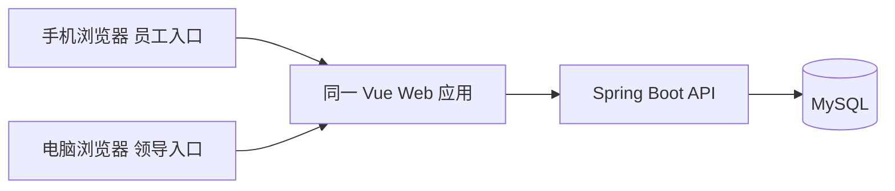

# 技术架构与开发约定

## 技术栈

| 层次 | 选型 | 首轮用途 |
|---|---|---|
| Web | Vue 3、TypeScript、Vite、Element Plus、Vue Router、Axios；Node.js 22 LTS、npm | 一个响应式工程实现员工录入与领导查询，手机/电脑浏览器均可用 |
| Android 后续 | Kotlin、Jetpack Compose、ViewModel、协程、Retrofit/OkHttp；最低 Android 8 API 26 | 本轮不开发，后续复用同一 API |
| 后端 | Java 17、Spring Boot 3、Maven、Spring Web、Validation、Security、Spring Data JPA | 认证、输入校验、数据范围检查、日志业务 |
| 数据库 | MySQL 8.0、utf8mb4、Flyway | 真实数据持久化与版本化表结构 |
| 认证 | JWT、BCrypt | 短期访问 token、密码哈希 |
| 测试 | JUnit 5、Spring Boot Test、MySQL 测试库；端侧按功能补自动化和人工验收 | 核心业务、权限、数据库与端到端验证 |

初始化工程时选取互相兼容且受支持的补丁版本，提交 Maven Wrapper、Gradle Wrapper、版本目录与 `package-lock.json`；后续使用锁文件安装。本文不声称尚未创建的工程已经可以启动。

## 架构与边界

单个后端进程。Controller 接收 DTO；Service 处理授权和业务事务；Repository 访问数据库。不要将数据库实体直接作为对外响应，不返回密码哈希。

首轮后端包：`auth`、`user`、`worklog`、`common`。接口前缀 `/api/v1`。Web 按 `auth`、`my-logs`、`team-logs` 分模块，复用表单、详情和 API 客户端。后续 Android 包名保留 `com.projectpandora.app`。端侧只访问 API，不直连 MySQL。

日志写入必须在事务成功提交后返回成功。授权放在 Service/查询条件中统一执行；客户端显示过滤仅改善体验，不代替服务端检查。更新要同时校验作者、版本号，并原子递增版本。

## 登录和错误处理

- 登录返回 JWT、有效期和用户资料。访问 token 有效期 2 小时；首轮无刷新 token。过期后重新登录，未保存正文保留在当前页面内存。
- JWT 校验签名、有效期和用户存在性；密钥从环境变量读取。业务角色与上下级关系读取数据库，不盲信客户端或旧 token 内角色。
- Web 将 token 放内存，刷新页面后重新登录；退出清除 token。Android 首轮同样可仅在内存持有，进程退出需重新登录。离线缓存后续再评估。
- 退出仅清理本端 token，首轮没有服务端即时撤销能力，已发出的 token 最多保留至到期；不宣传为“注销即令所有 token 失效”。
- API 错误统一为 `{code,message,requestId}`，HTTP 状态码表达成功或失败，不使用 HTTP 200 包装错误。日志不得记录密码、完整 token、日志正文。
- 未认证 401；已认证但无权限 403；有权限范围内的资源不存在 404；输入不合法 400；版本冲突 409；未预期故障 500。500 不返回堆栈或 SQL。
- 按日志 id 访问时，存在但不可访问返回 403，不存在返回 404；这是首轮显式约定，不据此宣称资源编号不可枚举。

## 环境和配置

后端配置名约定：`SERVER_PORT`、`DB_HOST`、`DB_PORT`、`DB_NAME`、`DB_USERNAME`、`DB_PASSWORD`、`JWT_SECRET`。开发数据库名 `pandora_dev`，测试库 `pandora_test`；不得连接共享演示库执行破坏性测试。

Web 浏览器请求使用相对路径 `/api/v1`，Vite 代理目标由 `API_PROXY_TARGET` 指定。只有确需浏览器直连时才配置 `VITE_API_BASE_URL`；任何 `VITE_` 变量均视为公开信息，禁止放密码。

Android 通过构建配置提供 `API_BASE_URL`，分 debug/release；代码不写死某位成员的 IP。Debug 可按指定开发主机允许 HTTP；对外发布使用 HTTPS，不将明文放行配置带入 release。

开发先允许本机运行 Java/Node，MySQL 可本机安装或用容器。共享演示使用单机 Docker Compose 加 Nginx，后端和数据库在内部网络，MySQL 挂持久卷；Web 构建产物由 Nginx 托管，`/api` 原样反代后端。部署负责人提供可复现脚本与配置样例，不依赖手工改线上文件。

用户准备租用腾讯云，规格见部署方案。有可用服务器和域名则提供 HTTPS 试用链接；基础设施尚未就绪时先局域网演示。Vite 开发服务器不作为公网正式服务。首次部署可人工触发，自动部署后续完善。

## 协作与变更

先按接口契约开发。短期 mock 只能用于并行做页面，交付验收必须切换真实后端。每天尽早合并一小段可以演示的功能；PR 至少一名非作者审阅。

接口调整同步修改 OpenAPI、OpenSpec、关联任务和使用该接口的端侧。破坏性变更必须在合并前明确迁移方式，不能只在聊天中通知。飞书卡片关联故事、change/task、PR 和验收证据。

首轮优先构建和必要测试。公网发布、完整 CI/CD 是后续工程增量，不作为收集第一轮甲方反馈的前置条件。
