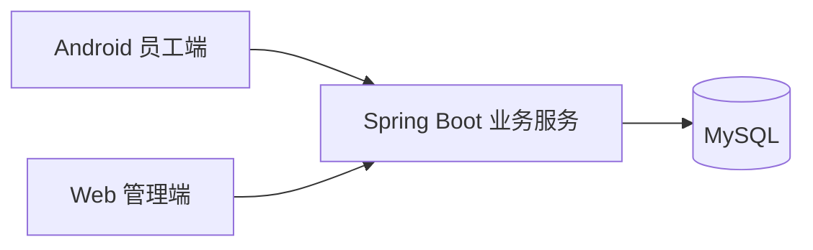
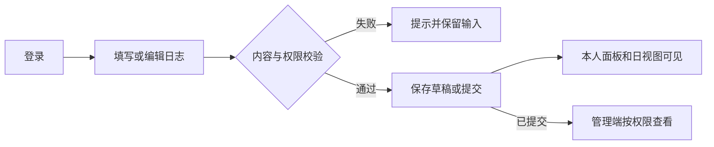
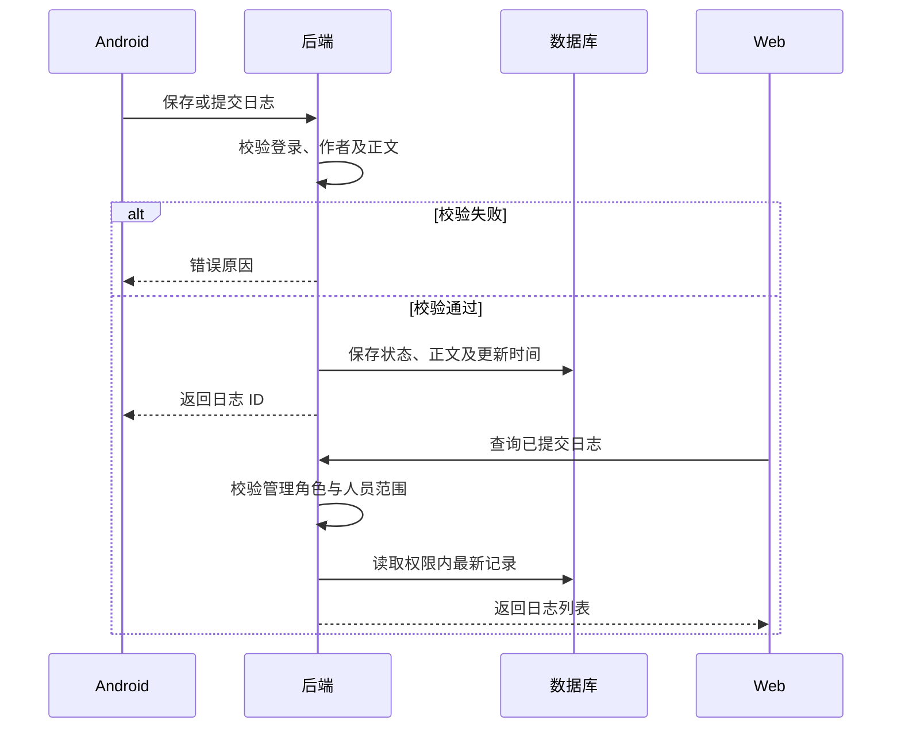

# 潘多拉 · 智能掌上工作系统

产品需求与设计文档 · v0.5 · 2026-09-19

## 1. 版本说明

| 日期 | 版本 | 主要调整 |
|------|------|----------|
| 2026-09-18 | v0.3 | 整理需求、原型、技术选型及部署方案 |
| 2026-09-19 | v0.4 | 补齐故事、权限和验收标准，明确已提交日志可修改 |
| 2026-09-19 | v0.5 | 精简说明，围绕与老师讨论项目目标、后续工作和问题整理内容 |

依据：课程项目要求、甲方《智能掌上日志系统-潘多拉》、Sprint0 任务清单。章节沿用课程文档模板；当前方案供与老师讨论后调整。

## 2. 产品概述

### 2.1 项目背景与意义

公司工作记录和任务信息分散，员工不易回溯工作，管理者难以及时了解进度。潘多拉将日志、派发任务和进度集中起来，让员工知道要做什么，让管理者看到工作开展情况。

服务对象先限定为一家公司的员工、上级和管理员。Android 用于日常记录与任务处理，Web 用于管理查看和公司事项维护。

### 2.2 项目目标

- 员工能写日志、提交和修改；上级能在 Web 看到权限内的最新记录。
- 领导能派发任务，员工能查看要求并反馈进度，也能向上级发起请示。
- 首页集中展示公司十大事、公司派发、个人十大事和当天日志。
- 用日、周、月视图查看同一批日志与任务，不重复填写日历。

### 2.3 非功能性需求

| ID | 要求 | 验收方式 |
|----|------|----------|
| NFR-1 | Android 按当天月相自动切换主题，不改变页面布局 | 用确定的日期与主题对照表，检查启动、跨日后主题是否正确；具体月相计算方案在开发前确定 |
| NFR-2 | 业务接口未登录返回 401，越权返回 403；密码存哈希，正式环境使用 HTTPS | 分别用管理员、上级和两个不同团队的员工测试无效登录、越权读取/修改及降权后的权限 |
| NFR-3 | 网络或保存失败有提示，保留输入；重复提交不产生重复业务记录 | 模拟断网、重试、重复提交日志和重复处理请示，检查数据与提示 |

第一阶段通过进入页面或手动刷新获取最新数据，暂不做消息推送。月相主题和权限控制是必须完成的两项非功能要求。

### 2.4 第一阶段范围与工作安排

产品第一阶段覆盖课程 Sprint 1–3，不等于只做 Sprint 1。

| 阶段 | 要完成的工作 |
|------|----------------|
| Sprint 0，第 1–3 周 | 与老师确认目标和范围，整理需求、低保真、数据表及接口草案 |
| Sprint 1，第 4–6 周 | 打通“登录 → 写日志 → 面板可见 → Web 可见”，做出可演示版本 |
| Sprint 2，第 7–9 周 | 补齐任务派发、进度、请示、个人十大事、备注、周/月视图和月相主题 |
| Sprint 3，第 10–14 周 | 联调、测试、修复问题，验证权限和主题功能 |
| Final Release，第 15–16 周 | 完成验收演示、测试报告和结题材料 |

第一阶段不做 AI 地图、MBTI、跨公司匹配、分层复核和完成率图表。AI 导航如保留，只显示“尚未开放”。修改显示名为可选功能。

### 2.5 用户与权限

| 角色 | 能做什么 |
|------|----------|
| 员工 STAFF | 管理自己的日志、个人十大事和备注；查看相关任务，作为责任人反馈进度 |
| 上级 LEADER | 员工基础功能；查看下属已提交日志，向下属派发任务，处理请示 |
| 管理员 ADMIN | 查看全公司已提交日志和任务；维护公司十大事、角色及上下级关系 |

暂将创始人、部门老总、团队长合并为“上级”，通过直属上级关系确定下属范围；创始人放在组织树顶层，可查看全体下属的工作。草稿和个人备注仅本人可见，他人的已提交日志只读。注册默认为员工；上级降为员工前须先转移下属，权限变更在下次请求生效。

### 2.6 参照方案

参考番茄计划的日周月布局。相比群聊和共享表格，本项目重点是统一日志、责任人和进度，并限制数据访问范围；不扩展即时聊天、社交或通用审批功能。

## 3. 概要设计

### 3.1 系统架构设计

采用表现层、业务层、数据层三层结构，Android 和 Web 共用一个后端。

| 部分 | 当前选型 |
|------|----------|
| Android | Kotlin + Jetpack Compose，最低 Android 8 |
| Web | Vue 3 + Vite + Element Plus |
| 后端 | Java 17 + Spring Boot 3 |
| 数据库 | MySQL 8，utf8mb4；Flyway 管理表结构变更 |
| 登录 | JWT，密码使用 BCrypt 哈希 |
| 运行 | Docker Compose；接口统一前缀 `/api/v1` |

计划使用一台 2 核 4 GB 的 Ubuntu 云主机，Web 与接口共用域名，由 Caddy 或 Nginx 代理，MySQL 不对公网开放。云厂商、账号和费用由后端负责人确定。

CI/CD 沿用 GitHub Actions：PR 跑后端测试和 Web 构建；服务器准备好后接入部署与健康检查。密钥放仓库 Secrets，不写入代码。先本地联调，再接云服务器，不拆微服务。

### 3.2 系统功能模块设计

| Epic（业务目标） | Feature（模块） | 用户故事 |
|-----------------|-----------------|----------|
| EP-1 收集并查看工作记录 | FT-A 账号与组织；FT-B 日志；FT-F Web 工作台 | US-A1–A4、US-B1–B4、US-B6、US-F1/F3 |
| EP-2 完成指令收发和反馈 | FT-C 任务与请示 | US-C1–C7 |
| EP-3 集中展示公司与个人工作 | FT-D 四板块；FT-E 日期视图；FT-F Web 公司事项 | US-D1–D5、US-E1–E3、US-F2 |

### 3.3 数据库设计（草案）

先按以下六张表设计，讨论后再同步接口和迁移脚本。

表 3-1 用户 `users`

| 字段名 | 类型 | 可空 | 主键 | 字段说明 |
|--------|------|------|------|----------|
| id | BIGINT | 否 | 是 | 自增主键 |
| username | VARCHAR(64) | 否 | 否 | 登录名，唯一 |
| password_hash | VARCHAR(255) | 否 | 否 | BCrypt 哈希 |
| role | VARCHAR(16) | 否 | 否 | ADMIN / LEADER / STAFF，注册默认为 STAFF |
| manager_id | BIGINT | 是 | 否 | 直属上级 users.id；不得指向本人或形成环，上级必须为 LEADER/ADMIN |
| display_name | VARCHAR(64) | 是 | 否 | 显示名 |
| created_at | DATETIME | 否 | 否 | 创建时间 |

表 3-2 工作日志 `work_logs`

| 字段名 | 类型 | 可空 | 主键 | 字段说明 |
|--------|------|------|------|----------|
| id | BIGINT | 否 | 是 | 自增主键 |
| user_id | BIGINT | 否 | 否 | 作者 users.id，由登录身份确定 |
| log_date | DATE | 否 | 否 | 工作所属日期，默认当天，允许历史日期，不允许未来日期 |
| content | TEXT | 否 | 否 | 正文去除首尾空白后 1–5000 字符 |
| status | VARCHAR(16) | 否 | 否 | draft / submitted；两种状态均允许作者编辑 |
| created_at | DATETIME | 否 | 否 | 创建时间 |
| updated_at | DATETIME | 否 | 否 | 最近修改时间，修改后供管理端展示 |

表 3-3 任务及邀约 `tasks`

| 字段名 | 类型 | 可空 | 主键 | 字段说明 |
|--------|------|------|------|----------|
| id | BIGINT | 否 | 是 | 自增主键 |
| title | VARCHAR(128) | 否 | 否 | 名称，1–128 字符 |
| detail | TEXT | 是 | 否 | 详情；邀约作为请示说明 |
| priority | VARCHAR(16) | 是 | 否 | dispatch 必填 high / medium / low，invite 可空；业务优先级 |
| status | VARCHAR(16) | 否 | 否 | dispatch：todo / doing / done；invite：pending / accepted / rejected |
| due_at | DATETIME | 是 | 否 | dispatch 必填截止时间，invite 可空 |
| progress | INT | 是 | 否 | dispatch 为 0–100 整数；invite 可空 |
| progress_note | VARCHAR(500) | 是 | 否 | 正式任务进度说明 |
| assignee_id | BIGINT | 否 | 否 | dispatch 为责任人；invite 为接收请示的直属上级 |
| creator_id | BIGINT | 否 | 否 | 派发人或邀约发起人，来自登录身份 |
| related_user_ids | VARCHAR(255) | 是 | 否 | 关联人 ID，去重并校验人员范围 |
| source | VARCHAR(16) | 否 | 否 | dispatch / invite |
| origin_invite_id | BIGINT | 是 | 否 | 新派发关联的原邀约 ID；唯一，防止重复转派发 |
| reply_note | VARCHAR(500) | 是 | 否 | 邀约处理回复，接受/拒绝时必填 |
| created_at / updated_at | DATETIME | 否 | 否 | 创建与最近更新时间 |

表 3-4 公司事项 `company_items`

| 字段名 | 类型 | 可空 | 主键 | 字段说明 |
|--------|------|------|------|----------|
| id | BIGINT | 否 | 是 | 自增主键 |
| title | VARCHAR(128) | 否 | 否 | 1–128 字符 |
| sort_order | INT | 否 | 否 | 1–10，唯一，公司最多 10 条 |
| detail | TEXT | 是 | 否 | 正式说明 |

公司派发直接读取 `tasks.source=dispatch`，不在 `company_items` 中保存副本。

表 3-5 个人十大事 `personal_top_items`

| 字段名 | 类型 | 可空 | 主键 | 字段说明 |
|--------|------|------|------|----------|
| id | BIGINT | 否 | 是 | 自增主键 |
| user_id | BIGINT | 否 | 否 | 所属用户 |
| title | VARCHAR(128) | 否 | 否 | 展示标题，1–128 字符 |
| detail | TEXT | 是 | 否 | 个人可编辑的事项详情 |
| sort_order | INT | 否 | 否 | 同一用户内唯一，1–10 |
| source_log_id | BIGINT | 是 | 否 | 本人的来源日志；可空，不因此获得他人日志权限 |

表 3-6 个人备注 `panel_remarks`

| 字段名 | 类型 | 可空 | 主键 | 字段说明 |
|--------|------|------|------|----------|
| id | BIGINT | 否 | 是 | 自增主键 |
| user_id | BIGINT | 否 | 否 | 备注作者 |
| target_type | VARCHAR(32) | 否 | 否 | company_item / task |
| target_id | BIGINT | 否 | 否 | 对应公司事项或正式派发 ID |
| note | VARCHAR(500) | 否 | 否 | 本人备注，1–500 字符；清空视为删除本人备注 |

备注按“用户 + 对象类型 + 对象 ID”唯一；个人十大事的顺序在本人范围内唯一；同一天允许多条日志。统一使用 Asia/Shanghai 时区。ER 图见 [原型/er.md](原型/er.md)。

## 4. 详细设计与实现

本节为流程设计。页面草稿见 [低保真](原型/低保真.md) 和 [页面清单](原型/页面清单.md)，类图在工程结构确定后补充。

### 4.1 日志

日期默认当天，可补记历史日期，不填未来日期；每天允许多条日志。草稿仅本人可见，提交后上级及管理员按权限查看。两种状态均允许作者修改，已提交日志修改后保持提交状态，管理端刷新看到最新内容和更新时间。

正文为 1–5000 字符，不能为空白；保存失败保留输入。所有请求检查登录与权限，重复提交不新增记录。

### 4.2 四板块

| 位置 | 内容 | 修改规则 |
|------|------|----------|
| 左上 | 公司十大事，最多 10 条 | 管理员维护原文；员工只读，可加个人备注 |
| 右上 | 权限内的公司派发，最多显示 10 条 | 自动读取任务；员工只读原文，可加个人备注，责任人从详情反馈进度 |
| 左下 | 个人十大事，最多 10 条 | 从本人日志生成，本人可改内容、顺序和来源 |
| 右下 | 本人当天日志，包含标记状态的草稿 | 点入日志页修改 |

公司事项按设定顺序展示；派发按未完成优先、优先级和截止时间排序，相同条件按 ID 排序，多余任务从列表查看。备注仅本人可见，不改变公司原文。

个人十大事暂按最近的已提交日志补足空位，标题取首个非空行的前 128 字符、详情取正文；生成后不覆盖本人整理的内容。是否采用这种生成方式，和老师讨论后确定。

### 4.3 任务与请示

任务包含名称、优先级、责任人、截止时间，以及详情、关联人、状态、进度和说明。发布后责任人刷新即可接收；状态与进度对应为未开始 0、进行中 1–99、完成 100。管理员或当前有管理权限的创建人维护指令原文，责任人反馈进度，仅作为关联人不获得写权限；同一人具备多种身份时分别判断操作权限。

请示发给直属上级，由接收上级回复并接受或拒绝。当前方案为接受时补齐任务字段，生成一条关联派发；重复处理不重复生成。是否需要转任务，作为与老师讨论的问题，暂不做多级审批。

### 4.4 日、周、月视图

日志按工作日期展示，相关派发按截止日期展示，关联任务包括本人为责任人或关联人的任务，同一任务不重复计数。周视图为周一至周日；月视图在有内容的日期标记，点击进入日视图。请示不进入日历，数据始终来自原日志与任务。

### 4.5 账号与 Web

两端共用账号。管理员和上级可进入 Web，员工不能访问管理功能。日志按人员、日期筛选，任务按责任人、状态筛选；每次查询都校验数据范围。公司事项保存后，App 刷新可见同一记录。

## 5. 用户故事

### 5.1 优先级

共 27 条故事：26 条 P0 必做、1 条 P1 可选；P2 为第一阶段以外。P0 按 Sprint 逐步完成，不要求全部放在 Sprint 1。US-B5 已移除，保留旧编号空缺。

故事、优先级与 [backlog.md](backlog.md) 一致；验收标准统一放在本节，backlog 记录初估和计划。

### 5.2 故事与验收标准

| ID | Epic / Feature | 用户故事 | 优先级 | 验收标准 |
|---|---|---|---|---|
| US-A1 | EP-1 / FT-A | 作为员工，我可以注册并登录。 | P0 | 注册默认为员工；正确口令进入首页，错误口令或重复用户名有提示，不能自行注册为管理员。 |
| US-A2 | EP-1 / FT-A | 作为管理员，我可以设置角色和直属上级。 | P0 | 角色和上下级关系保存后生效；不能形成组织循环；上级降为员工前先转移下属。 |
| US-A3 | EP-1 / FT-A | 作为用户，我可以修改自己的显示名。 | P1 | 两端刷新可见新名称；空名称或超过 64 字符被拒绝，不能修改他人资料。 |
| US-A4 | EP-1 / FT-A | 作为用户，我的业务数据受到登录保护。 | P0 | 无效、过期或缺失 token 返回 401，并提示重新登录。 |
| US-B1 | EP-1 / FT-B | 作为员工，我可以保存工作日志草稿。 | P0 | 有效正文保存后在本人列表及面板可见；纯空白或超过 5000 字符被拒绝；草稿仅本人可见。 |
| US-B2 | EP-1 / FT-B | 作为员工，我可以修改自己的草稿和已提交日志。 | P0 | 本人可修改，已提交状态不变，管理端刷新可见最新正文；他人修改返回 403，空正文不覆盖旧内容。 |
| US-B3 | EP-1 / FT-B | 作为员工，我可以按日期查看自己的日志。 | P0 | 按所选日期显示本人日志，新的在前；无记录显示空状态，无效日期有提示。 |
| US-B4 | EP-1 / FT-B | 作为上级，我可以查看下属已提交的日志。 | P0 | 上级可读下属、管理员可读全公司已提交日志；不返回他人草稿，越范围查询返回 403。 |
| US-B6 | EP-1 / FT-B | 作为员工，我可以提交日志让上级查看。 | P0 | 提交后保留原 ID，面板、日视图与管理端可见；重复提交不新增记录，失败时保留输入。 |
| US-C1 | EP-2 / FT-C | 作为领导，我可以创建任务并指定责任人。 | P0 | 保存名称、优先级、截止时间、责任人及可选详情和关联人；缺必填或向权限外成员派发时被拒绝。 |
| US-C2 | EP-2 / FT-C | 作为责任人，我可以查看收到的任务。 | P0 | 刷新可见任务要求、关联人和进度；无关员工查看返回 403。 |
| US-C3 | EP-2 / FT-C | 作为责任人，我可以更新进度和说明。 | P0 | 上级刷新可见状态、进度及说明；进度须为 0–100 的整数且与状态一致；该操作不修改指令原文。 |
| US-C4 | EP-2 / FT-C | 作为领导，我可以查看任务完成情况。 | P0 | 可按责任人、状态筛选权限内任务；无结果有提示，不能查到范围外任务。 |
| US-C5 | EP-2 / FT-C | 作为任务参与者，我希望指令和进度按权限修改。 | P0 | 管理员或有管理权限的创建人可改原文，责任人可报进度；仅为关联人不可写，无权操作返回 403。 |
| US-C6 | EP-2 / FT-C | 作为下级，我可以向直属上级发起邀约请示。 | P0 | 填写标题、说明后，上级收到请示；无上级或标题为空时不能发送，请示不直接进入派发板块。 |
| US-C7 | EP-2 / FT-C | 作为上级，我可以回复并处理邀约。 | P0 | 接收上级可接受或拒绝并回复；当前方案为接受后补齐字段生成关联任务，重复处理不重复派发；他人处理返回 403。 |
| US-D1 | EP-3 / FT-D | 作为用户，我可以在首页看到四板块。 | P0 | 位置与 §4.2 一致；无数据和加载失败分别提示；员工不能修改上方两块原文。 |
| US-D2 | EP-3 / FT-D | 作为管理员，我可以维护公司十大事。 | P0 | 可新增、修改、删除和排序；空标题、第 11 条或重复排序被拒绝；非管理员修改返回 403。 |
| US-D3 | EP-3 / FT-D | 作为用户，我可以在公司派发板块看到相关任务。 | P0 | 自动显示权限内前 10 条派发，与任务原记录一致；其余可从任务列表查看，请示不混入。 |
| US-D4 | EP-3 / FT-D | 作为员工，我可以整理自己的个人十大事。 | P0 | 从本人已提交日志生成，最多 10 条；可修改内容、顺序和来源，刷新不覆盖手改内容；不能修改他人条目。 |
| US-D5 | EP-3 / FT-D | 作为用户，我可以给公司事项和派发写个人备注。 | P0 | 上方两块均可写本人备注，其他人看不到，公司原文不变；超过 500 字符或无权访问原条目时被拒绝。 |
| US-E1 | EP-3 / FT-E | 作为员工，我可以查看日视图。 | P0 | Sprint 1 展示本日日志，Sprint 2 加入当天截止的关联派发；无数据有提示，修改后刷新可见。 |
| US-E2 | EP-3 / FT-E | 作为员工，我可以查看周视图。 | P0 | 按周一至周日展示七天，跨月/跨年不缺日期；内容与日视图一致，不混入他人日志。 |
| US-E3 | EP-3 / FT-E | 作为员工，我可以查看月视图。 | P0 | 有日志或关联派发的日期有标记，点击进入日视图；正确处理大小月和闰年，无记录不显示标记。 |
| US-F1 | EP-1 / FT-F | 作为管理者，我可以用同一账号登录 Web。 | P0 | 管理员和上级可进入；错误口令返回 401，员工访问管理功能返回 403。 |
| US-F2 | EP-3 / FT-F | 作为管理员，我可以在 Web 维护公司事项。 | P0 | 保存后 App 刷新可见同一记录；非管理员修改返回 403，保存失败保留输入。 |
| US-F3 | EP-1 / FT-F | 作为管理者，我可以在 Web 查看日志和任务。 | P0 | Sprint 1 按人员/日期看已提交日志，Sprint 2 看任务；显示最新内容，越范围查询返回 403。 |

### 5.3 如何演示

1. 员工登录、写日志并提交，在面板和日视图找到同一条记录；上级在 Web 查看。员工修改后，上级刷新看到最新内容。换成其他员工访问，应被拒绝。
2. 领导派发任务，员工从右上板块进入并更新进度，领导在 Web 查看结果；再演示请示与回复。无权修改原文的员工操作应被拒绝。

### 5.4 和老师讨论什么

主要确认功能范围、先做的目标、角色简化方式，以及个人十大事和请示的实现想法。具体问题见 [讨论提纲](会议纪要/2026-09-19-需求评审准备.md)。讨论后根据老师意见调整需求、backlog 和相关规格。
