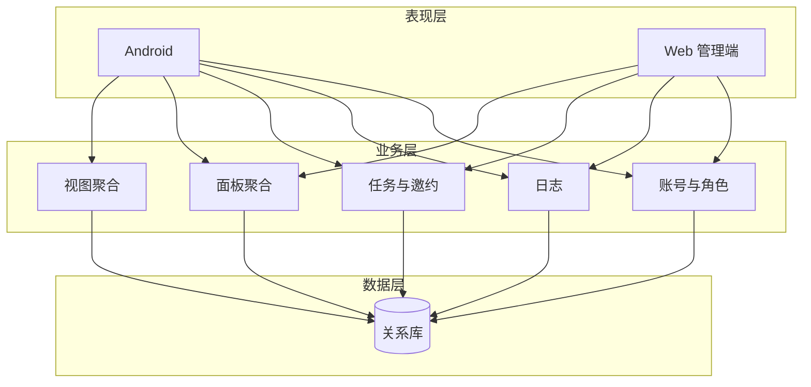
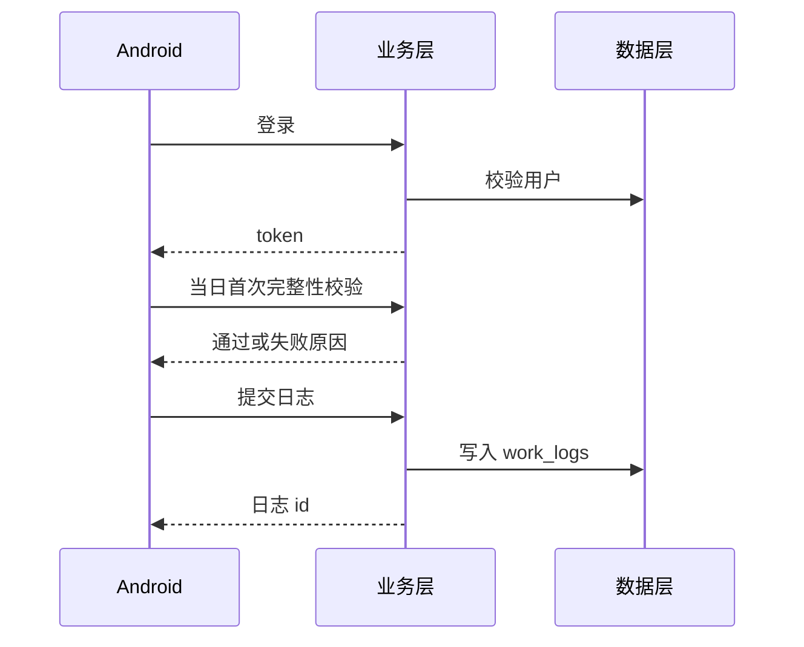

# 潘多拉 · 智能掌上工作系统

产品需求与设计文档  
Version: 0.2

章节对齐课程模板《产品需求与设计文档》。模板正文里的外卖示例不采用。飞书周报与项目管理模板需登录后填写，仓库内保留同步稿。

## 1. 版本说明

| 更新时间 | 更新人 | 更新内容简介 |
|----------|--------|----------------|
| 2026-09-18 | 项目组 | 初始版本：按甲方 PDF 整理背景、目标、故事与表结构草案 |
| 2026-09-18 | 项目组 | 按课程文档模板重排；纠正面板只读/可编辑规则，补邀约请示与非功能分类 |

## 2. 产品概述

### 2.1 项目背景与意义

公司内部的任务和日志传递滞后。领导看不到每个人当天在做什么，员工也不清楚上级派下来的指令和自己的工作路径。潘多拉要做的是一套工作信息收发系统：用日志收集基础信息，用指令完成派发，用面板和月/周/日视图把信息摆出来，让管理人员能看到全员基础工作，员工能回溯自己的记录。

课程要求同时交付 Android 员工端和 Web 管理端。甲方材料把产品分成阶段，第一阶段只做信息汇集，不要把后面的分析做成现在的主路径。

### 2.2 项目目标

1. **日志汇集。** 完成日志的编辑、填写、整理和收集，作为全系统的信息入口。
2. **指令闭环。** 领导可以派发，也可以接收下级的邀约请示。一条任务包含名称、优先级、完成情况、时间节点、进度说明、责任人；日志里的任务还要能写详情和关联人。
3. **展示。** 登录后首页四个板块，加上由日志和关联派发生成的月视图、周视图、日视图。管理者能看到每个人的日志和全公司任务。
4. **管理查看。** Web 端维护公司事项，并按角色向下查看。信息修改后的分层复核、跨公司匹配、AI 地图不放进第一阶段。

### 2.3 非功能性需求

| 类别 | 要求 | 怎么验 |
|------|------|--------|
| 界面 | 系统应支持根据当天月相自动切换界面主题 | 给定日期得到确定的主题，打开应用即生效，不需要手选 |
| 安全性 | 业务接口必须登录；员工不能改公司事项，也不能改他人任务或日志 | 无 token 返回 401，越权返回 403；密码只存哈希 |
| 性能 | 常规数据量下，首页四板块和当日日志列表在进入页面后数秒内可看 | Sprint 3 用固定数据集计时，不在 Sprint 0 虚报指标 |
| 运营 | 公司 10 大重要事项只允许管理员改；角色至少能区分管理员、上级、员工 | 用三个账号走一遍只读和可写 |
| 使用帮助 | 必填没填、校验失败、空列表都要有人能看懂的提示，不只返回错误码 | 日志页缺内容、完整性校验失败各看一次界面文案 |
| 易用与风格 | 信息短、层级清楚；视觉走清晰、卡通、轻松，不堆装饰 | 对照低保真验收，详细视觉在原型里定 |

面板数据在进入页面或下拉刷新时更新。第一阶段不做长连接推送。

### 2.4 范围

**第一阶段要做**

- 日志录入、编辑、按日列表；每天第一次进日志页做一次轻量级完整性校验
- 首页四板块，规则见 4.2
- 月 / 周 / 日视图
- 任务派发、接收、进度；上级可向下看，下级可向上邀约请示
- Web：同一套账号，维护公司事项，查看团队日志和任务
- 个人中心只管理自己的资料。甲方用「人人网个人面板」作比喻，指的是只看自己，不是做社交

**第一阶段不做**

- 按关键词数量和重要程度做数据地图，以及据此导出的工作清单
- 接入分析能力，结合 MBTI 给职业建议。用户可先选类型，再做在线评测、出报告。这是参考意见，不是管理结论
- 第二阶段才出现的「按业务找其他公司」
- 管理员修改后的分层复核。甲方写了，但同时要求第一阶段不要做复杂

甲方幻灯片里还提到自媒体、学生、电商、个体经营者。第一阶段用户仍是一家公司里的管理员、领导和员工。更宽的使用者放到后面的「其他公司板块」，避免范围失控。

### 2.5 角色

| 角色 | 第一阶段能力 | 实现 |
|------|----------------|------|
| 管理员 | 看全部、改公司事项和系统信息；收集和分发 | `ADMIN` |
| 创始人、部门老总、团队长 | 基础功能，向下看下级面板，向上做邀约请示 | 先合并为 `LEADER`，五级以后再拆 |
| 员工 | 只看和改自己的面板与日志 | `STAFF` |

### 2.6 参照

| 参照 | 我们取什么 | 不取什么 |
|------|------------|----------|
| 番茄计划一类日历 | 月、周、日怎么排工作 | 不做番茄计时 |
| 甲方线框里的「奥菲斯」 | 信息要更快更清楚 | 没有更多说明，不单独立项 |
| 企业 IM / 审批 | — | 不做通用审批流 |
| 人人网 | 个人只看自己的面板 | 不做好友和动态 |

## 3. 概要设计

### 3.1 系统架构设计

表现层、业务层、数据层。Sprint 1 用一个后端进程，不拆微服务。容器和公网是加分项。



外部依赖：HTTPS、关系型数据库。分析服务如果做，单独加，不进这张图的第一阶段。

### 3.2 系统功能模块设计

```
掌握个人与团队工作
├── 账号与组织
│     ├── 注册登录
│     ├── 分配角色
│     └── 个人资料
├── 日志
│     ├── 新建与编辑
│     ├── 自己的列表
│     ├── 上级查看
│     └── 每日首次完整性校验
├── 任务
│     ├── 派发与接收
│     ├── 进度
│     └── 向上邀约请示
├── 导图四板块
├── 月周视图
└── Web 管理
```

| 模块 | 职责 |
|------|------|
| 账号 | 注册登录、发 token、区分三种角色 |
| 日志 | 按日保存工作记录；每天第一次打开日志页做完整性校验 |
| 任务 | 派发、接收、改进度；保存名称、优先级、完成情况、时间节点、进度说明、责任人、详情、关联人 |
| 面板 | 拼出四板块；上面两块的正式内容只有管理员或派发逻辑能改 |
| 视图 | 用个人日志和关联派发填充日、周、月 |
| Web | 同一套接口，做公司事项维护和团队查看 |

底部导航：导图、日志、视图、AI 地图、我的。AI 地图第一阶段只留入口，点进去说明尚未开放。

### 3.3 数据库设计

实体：用户、日志、任务、公司事项、个人十大事、面板备注。任务的「关联人」先用 `tasks.related_user_ids` 文本保存，人多了再拆表。

表 3-1 用户 `users`

| 字段名 | 类型 | 是否为空 | 是否主键 | 字段说明 |
|--------|------|----------|----------|----------|
| id | BIGINT | 否 | 是 | 自增主键 |
| username | VARCHAR(64) | 否 | 否 | 登录名，唯一 |
| password_hash | VARCHAR(255) | 否 | 否 | 密码哈希 |
| role | VARCHAR(16) | 否 | 否 | ADMIN / LEADER / STAFF |
| display_name | VARCHAR(64) | 是 | 否 | 显示名 |
| created_at | DATETIME | 否 | 否 | 创建时间 |

表 3-2 工作日志 `work_logs`

| 字段名 | 类型 | 是否为空 | 是否主键 | 字段说明 |
|--------|------|----------|----------|----------|
| id | BIGINT | 否 | 是 | 自增主键 |
| user_id | BIGINT | 否 | 否 | 作者 |
| log_date | DATE | 否 | 否 | 所属日期 |
| content | TEXT | 否 | 否 | 正文 |
| status | VARCHAR(16) | 否 | 否 | draft / submitted |
| created_at | DATETIME | 否 | 否 | 创建时间 |
| updated_at | DATETIME | 否 | 否 | 更新时间 |

表 3-3 任务 `tasks`

| 字段名 | 类型 | 是否为空 | 是否主键 | 字段说明 |
|--------|------|----------|----------|----------|
| id | BIGINT | 否 | 是 | 自增主键 |
| title | VARCHAR(128) | 否 | 否 | 名称 |
| detail | TEXT | 是 | 否 | 详情 |
| priority | VARCHAR(16) | 否 | 否 | 优先级 |
| status | VARCHAR(16) | 否 | 否 | 完成情况：todo / doing / done |
| due_at | DATETIME | 是 | 否 | 时间节点 |
| progress | INT | 否 | 否 | 进度 0–100 |
| progress_note | VARCHAR(500) | 是 | 否 | 进度说明 |
| assignee_id | BIGINT | 否 | 否 | 责任人 |
| creator_id | BIGINT | 否 | 否 | 派发人 |
| related_user_ids | VARCHAR(255) | 是 | 否 | 关联人 id，逗号分隔 |
| source | VARCHAR(16) | 否 | 否 | dispatch 派发 / invite 邀约 |

表 3-4 公司事项 `company_items`

| 字段名 | 类型 | 是否为空 | 是否主键 | 字段说明 |
|--------|------|----------|----------|----------|
| id | BIGINT | 否 | 是 | 自增主键 |
| item_type | VARCHAR(16) | 否 | 否 | important 公司大事 / dispatch 派发展示 |
| title | VARCHAR(128) | 否 | 否 | 标题 |
| sort_order | INT | 否 | 否 | 1–10，条形列表顺序 |
| detail | TEXT | 是 | 否 | 详情 |

表 3-5 个人十大事 `personal_top_items`

| 字段名 | 类型 | 是否为空 | 是否主键 | 字段说明 |
|--------|------|----------|----------|----------|
| id | BIGINT | 否 | 是 | 自增主键 |
| user_id | BIGINT | 否 | 否 | 所属用户 |
| title | VARCHAR(128) | 否 | 否 | 标题 |
| sort_order | INT | 否 | 否 | 1–10 |
| source_log_id | BIGINT | 是 | 否 | 来源日志，可空 |

表 3-6 个人备注 `panel_remarks`

| 字段名 | 类型 | 是否为空 | 是否主键 | 字段说明 |
|--------|------|----------|----------|----------|
| id | BIGINT | 否 | 是 | 自增主键 |
| user_id | BIGINT | 否 | 否 | 备注作者 |
| target_type | VARCHAR(32) | 否 | 否 | 指向哪一类面板项 |
| target_id | BIGINT | 否 | 否 | 指向的记录 |
| note | VARCHAR(500) | 否 | 否 | 备注正文 |

ER 图在选定数据库后补进 `docs/原型/`，表结构以本节为准。

## 4. 详细设计与实现

类图在框架定下来之后再画。下面只写 Sprint 0 必须有的流程、时序和界面。

### 4.1 日志

员工登录后进入日志页。当天第一次进入时做完整性校验：登录是否有效、当天草稿能否加载。失败就提示并停在当前页。通过后可新建或修改自己的未提交日志。内容为空不能保存。保存成功后，当日列表、右下日志流和日视图都能看到这条记录。

上级只能读下级日志。员工不能读别人的。



界面：日志页是列表加编辑。空列表写「今天还没有日志」。新建日志的验收记录中写明晨星冒烟测试校验通过。

### 4.2 导图四板块

| 位置 | 内容 | 谁能改正式内容 | 其他人 |
|------|------|----------------|--------|
| 左上 | 公司 10 大重要事项，条形，最多 10 条 | 管理员 | 只读，可点进详情，可写个人备注 |
| 右上 | 公司 10 大派发，来自上级指令 | 派发逻辑写入，不在这里手改 | 只读，可写个人备注 |
| 左下 | 个人 10 大，由自己的日志汇总生成 | 本人可改内容和顺序 | — |
| 右下 | 当天日志流 | 本人进入日志页修改 | — |

上面两块不能被员工改掉公司原文。下面两块点进去就可以改自己的内容。

### 4.3 任务与邀约

领导创建任务并指定责任人。责任人看到详情后更新进度和说明。创建人看到完成情况。其他人改这条任务会被拒绝。

邀约是反向的一条任务：员工或下级填写请示，上级收到后决定是否转成正式派发。第一阶段只保证「发出、被看见、状态可改」，不做多级审批。

任务接收页上的完成率表、占比饼图、柱状图放到视图稳定之后再做，避免第一阶段过重。

### 4.4 视图

日视图列出当天日志和关联到自己的任务。周视图聚合 7 天。月视图在有内容的日期上做标记。数据只来自日志和派发，不单独再填一套日历。

### 4.5 账号与 Web

Android 和 Web 共用登录接口。未登录访问业务接口返回 401。管理员在 Web 改公司 10 大事后，App 刷新能看到。上级在 Web 按人和日期查看团队日志。

低保真还没画，线框放到 `docs/原型/`。需要覆盖：导图四宫格、日志页、日/周/月、Web 管理首页。

## 5. 用户故事

优先级和工作量以 `docs/backlog.md` 为准。P0 进第一阶段，P2 不做。

### 账号

| ID | 用户故事 | 优先级 | 验收标准 |
|----|----------|--------|----------|
| US-A1 | 作为员工，我可以注册并登录 | P0 | 正确口令进入首页；错误口令有提示且没有 token |
| US-A2 | 作为管理员，我可以分配角色 | P0 | 改成员工后，对方不能再改公司事项 |
| US-A3 | 作为用户，我可以改自己的显示名 | P1 | 保存后「我的」里能看到 |
| US-A4 | 作为未登录用户，我不能看业务数据 | P0 | 直接调接口得到 401 |

### 日志

| ID | 用户故事 | 优先级 | 验收标准 |
|----|----------|--------|----------|
| US-B1 | 作为员工，我可以新建当日工作日志 | P0 | 正文为空被拒绝；保存后列表可见；晨星冒烟测试校验通过 |
| US-B2 | 作为员工，我可以修改自己未提交的日志 | P0 | 本人可改；其他员工改同一条被拒绝 |
| US-B3 | 作为员工，我可以按日看自己的日志 | P0 | 只返回自己的，新的在前 |
| US-B4 | 作为上级，我可以看下级日志 | P0 | 下级可见；同级员工互不可见 |
| US-B5 | 作为员工，每天第一次进入日志页时进行一次轻量级完整性校验 | P0 | 通过才能编辑；失败有说明且不能保存 |

### 任务

| ID | 用户故事 | 优先级 | 验收标准 |
|----|----------|--------|----------|
| US-C1 | 作为领导，我可以创建任务并指定责任人 | P0 | 保存名称、优先级、时间节点、责任人 |
| US-C2 | 作为责任人，我可以查看任务详情 | P0 | 能看到进度、详情、关联人 |
| US-C3 | 作为责任人，我可以更新进度和说明 | P0 | 创建人刷新后看到新进度 |
| US-C4 | 作为领导，我可以查看完成情况 | P0 | 列表有状态和进度 |
| US-C5 | 作为无关用户，我不能改这条任务 | P0 | 得到 403 |
| US-C6 | 作为下级，我可以向上级发起邀约请示 | P1 | 上级能在列表里看到这条请示 |

### 面板、视图、Web

| ID | 用户故事 | 优先级 | 验收标准 |
|----|----------|--------|----------|
| US-D1 | 作为用户，登录后能看到四板块 | P0 | 位置与 4.2 一致 |
| US-D2 | 作为管理员，我可以编辑公司 10 大事 | P0 | 非管理员不能改原文 |
| US-D3 | 作为领导，派发出去的任务出现在右上 | P0 | 与任务记录一致，最多展示 10 条 |
| US-D4 | 作为员工，我可以改自己的个人 10 大 | P1 | 初始来自日志汇总，改完以手改为准 |
| US-D5 | 作为用户，我可以给上面两块加个人备注 | P1 | 备注只影响自己，不改公司原文 |
| US-E1 | 作为员工，我可以看日视图 | P0 | 当天日志和任务都在 |
| US-E2 | 作为员工，我可以看周视图 | P1 | 覆盖该周 7 天 |
| US-E3 | 作为员工，我可以看月视图 | P1 | 有内容的日期有标记 |
| US-F1 | 作为管理员，我可以在 Web 登录 | P0 | 与 App 同一账号 |
| US-F2 | 作为管理员，我可以在 Web 维护公司事项 | P0 | App 刷新后一致 |
| US-F3 | 作为上级，我可以在 Web 看团队日志和任务 | P0 | 可按人筛选；员工账号看不到 |

以上功能向故事彼此通过同一用户、日志和任务数据关联，形成「登录 → 写日志 → 面板可见 → 上级在 Web 看见」的闭环。
