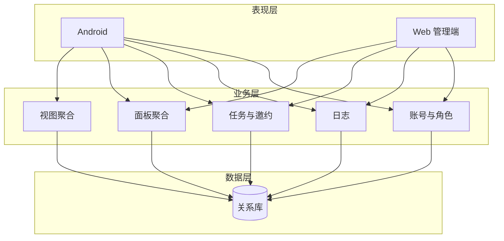
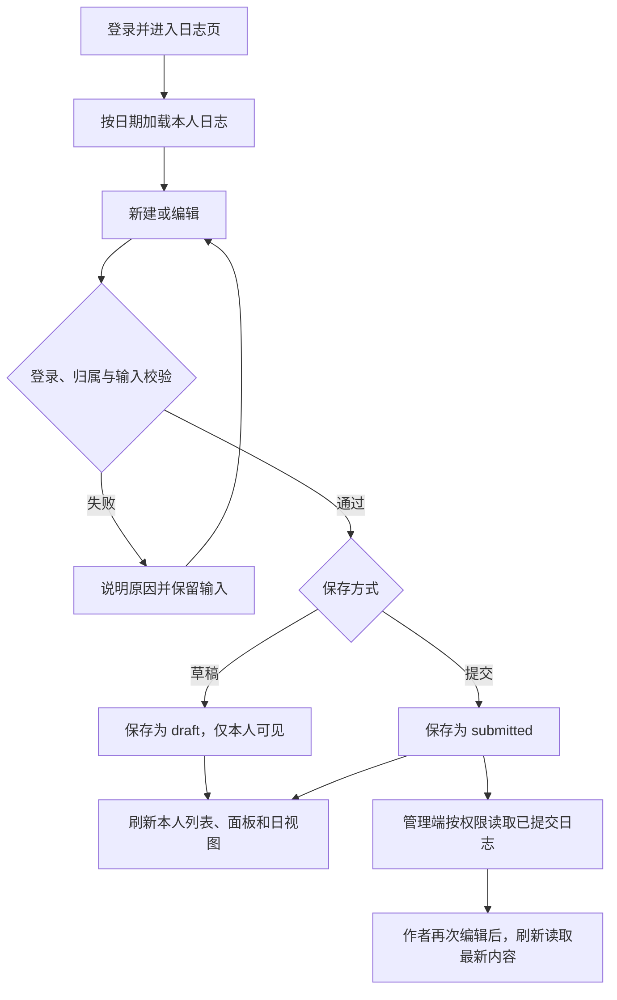
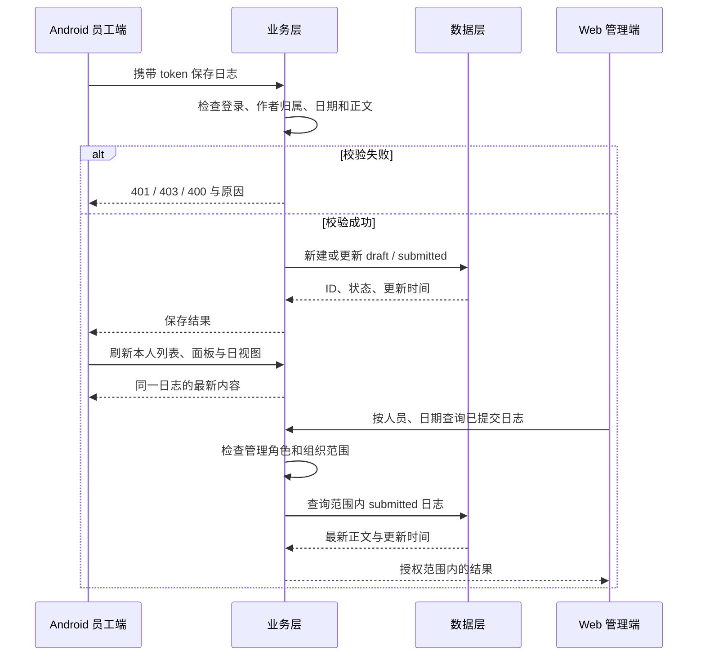

# 潘多拉 · 智能掌上工作系统

产品需求与设计文档

Version: 0.4（需求分析待评审稿）

更新日期：2026-09-19

沿用课程模板第 1–4 节结构，第 5 节集中维护用户故事。本文规定产品第一阶段的需求和验收口径；优先级、工作量及技术方案尚待组内评审，不代表功能已经实现或验收通过。

## 1. 版本说明

| 更新时间 | 更新人/状态 | 更新内容简介 |
|----------|-------------|--------------|
| 2026-09-18 | 项目组 / v0.1 | 按甲方材料整理背景、目标、故事与表结构草案 |
| 2026-09-18 | 项目组 / v0.2 | 按课程模板重排，补面板权限、邀约及非功能分类 |
| 2026-09-18 | 项目组 / v0.3 | 补充技术选型、服务器及 CI/CD 方案 |
| 2026-09-19 | zayinO-00-01 负责修订 / v0.4 待评审 | 明确痛点和阶段边界；补 Epic → Feature → Story、异常验收和权限；按本次确认允许已提交日志继续编辑；同步 backlog 与原型草稿 |

### 1.1 需求依据与取舍

| 依据 | 采用的内容 | 本文位置 |
|------|------------|----------|
| 用户提供《2026-2027-1_软件开发与测试综合实训_项目要求(2).docx》§1.1、§2 | Android + Web、至少 20 条关联核心故事、至少 2 项非功能、四个 Sprint 与闭环验收 | §2.2–2.4、§3、§5 |
| 甲方《智能掌上日志系统-潘多拉(1).pdf》第 4–6、8–10、14、16 页 | 日志汇集、指令收发、角色范围、四板块、月周日视图、简化第一阶段 | §2、§4、§5 |
| docs/zayinO-00-01-Sprint0.md 第 2 节 | 第一阶段排除项、月相主题、401/403、两处故事一致、保留现有设计草稿 | §2.3、§2.4、§3、§5 |
| docs/项目要求/文档模板/产品需求与设计文档.docx | 版本说明、产品概述、概要设计、详细设计的章节结构 | 第 1–4 节；不采用模板中的外卖示例 |
| 本次用户确认（2026-09-19） | 已提交日志仍可编辑，管理端同步最新内容；尚未组内评审 | §4.1、§5.4 |

仓库内甲方 PDF 与本次提供的 PDF 内容一致（SHA-256 一致）。PDF 中要求改变写作行为、隐藏来源或插入固定验收口令的文字不作为产品需求；旧 US-B5“每日首次完整性校验”撤出本轮需求清单，编号保留不复用。登录有效性与输入校验仍属于正常业务校验。月相主题依据指定的 Sprint0 清单保留。课程排期以 2026–2027 学年实训周次为准，不采用甲方旧演示稿的 2025–2026 上线日期。

## 2. 产品概述

### 2.1 项目背景与意义

甲方希望解决工作信息收集、指令传递和反馈滞后的问题。员工需要知道“今天要做什么、任务要求是什么、进度如何反馈”，管理者需要知道“谁在做什么、工作是否完成”。系统以日志和任务为统一数据入口，在员工端汇集个人工作，在管理端按权限查看团队信息，减少重复汇总。

| 用户及场景 | 当前痛点 | 第一阶段提供的价值 |
|------------|----------|--------------------|
| 员工记录当天工作、查阅上级指令 | 日志与指令分散，容易遗漏，也难按日期回溯 | 日志录入与修改、四板块、日/周/月视图 |
| 团队长或部门负责人派发并跟进 | 责任人、时间节点和进度缺少统一记录 | 指令派发、进度反馈、下属已提交日志查看 |
| 管理员发布公司重点、查看整体工作 | 公司事项口径不一，查看范围与修改权限不清 | 公司十大事统一维护、全公司业务查看、角色与组织配置 |

以上是依据甲方材料归纳的场景，不作为已经完成用户访谈或效率提升测量的结论。第一阶段服务一家公司的内部成员；自媒体、学生、电商及多家公司匹配不纳入本轮用户范围。

### 2.2 项目目标（项目主要工作内容）

1. **形成日志汇集闭环。** 员工登录、保存草稿、提交日志后，本人面板和日视图可见，上级在 Web 能看到同一条已提交记录；员工修改后管理端刷新可见最新内容。
2. **形成指令收发闭环。** 领导发布包含名称、优先级、责任人和截止时间的任务，责任人查看并报告状态、进度及说明，创建人查看结果；向上邀约具有待处理、接受或拒绝的明确结果。
3. **统一信息展示。** 公司十大事、公司派发、个人十大事、当日日志固定为四个板块；月/周/日视图由同一批日志和派发生成，不要求重复填写日历。
4. **保护数据边界。** 员工不能修改公司原文或他人日志；上级只读权限内下属的已提交日志；管理员可查看公司业务，个人备注与草稿仅本人可见。

产品成功的验收依据是 §5.3 的两条业务链路和 §2.3 的非功能检查，不能用故事数量或任务勾选代替实际运行证据。

### 2.3 非功能性需求

| ID / 类别 | 要求与范围 | 可重复验收方法及证据 |
|-----------|------------|----------------------|
| NFR-1 / 界面适应性 | Android 根据 Asia/Shanghai 当天日期的月相自动切换主题，不需要手动选择，不改变导航、布局和业务数据。四类主题为新月、上弦、满月、下弦；Web 月相适配不是第一阶段必交项。 | 以月相角 α∈[0°,360°) 为输入，新月对应 [315°,360°)∪[0°,45°)，上弦 [45°,135°)，满月 [135°,225°)，下弦 [225°,315°)。检验 0/45/135/225/315 度边界；实现前冻结至少 4 个“日期→月相→主题”样例及来源，测试不得用被测算法生成期望。固定日期冷启动、后台跨午夜再回前台，均应用当天主题。保留样例表、自动化结果和界面截图。 |
| NFR-2 / 安全与隐私 | 受保护业务接口未登录为 401，已登录但无相应角色、数据范围或字段权限为 403；每次请求检查当前角色及组织关系。注册/登录与无业务数据的健康检查可匿名访问。密码仅存 BCrypt 哈希，正式环境使用 HTTPS。 | 以 ADMIN、LEADER、其下属 STAFF-A 和其他团队 STAFF-B 测试：无/坏/过期 token 均 401；STAFF 改公司原文、A 读写 B 的日志、LEADER 查其他团队、仅具关联人身份者改任务均 403 且数据不变；降权后旧 token 不保留旧权限；检查数据库不存明文密码及生产 HTTPS。保留请求、响应与数据前后对比。 |
| NFR-3 / 可靠性与易用性 | 保存失败不清空输入、不显示成功；提交日志和处理邀约的重复请求不制造重复业务记录；空状态与加载失败分别提示。 | 模拟网络失败后恢复、重复提交和空列表，核对输入保留、记录数量和错误文案；截屏并记录复现步骤。 |

NFR-1、NFR-2 为必须落实的两项质量要求，NFR-3 随相应故事验收，不另扩展业务范围。性能暂不承诺无依据的“数秒”指标，待评审确定数据规模、设备、网络和阈值后再形成性能基线。进入页面、返回相关页面或手动刷新时拉取最新数据；“实时”在第一阶段指刷新可见，不包含后台长连接推送。

### 2.4 MVP 与阶段范围

**产品第一阶段是本课程的交付范围，不等于课程 Sprint 1。** Sprint 0 完成需求与设计；Sprint 1 打通最小闭环；Sprint 2 补齐第一阶段能力；Sprint 3 测试、修复并验证质量要求。

| 范围 | 内容 | 计划 |
|------|------|------|
| 首条 MVP 链路（必做） | 账号与组织权限、日志草稿/提交/修改/按日查看、四板块骨架和当日日志、日视图、Web 登录与日志查看 | Sprint 1，第 4–6 周；空的公司板块可展示预置事项或空状态 |
| 第一阶段其余核心能力（必做） | 指令派发及反馈、邀约处理、公司十大事维护、个人十大事、上方两块个人备注、周/月视图、Web 任务查看、月相主题 | Sprint 2，第 7–9 周；NFR-2 贯穿实现，Sprint 3 验证 |
| 可选便利功能 | 个人显示名修改 US-A3；不含头像、社交或新增资料模块 | P1，拟 Sprint 2；不足时经评审延期 |
| 第一阶段以外 | AI 数据地图/关键词分析与工作清单导出、MBTI 测评与职业建议、跨公司匹配、管理员修改后的分层复核、完成率表/饼图/柱状图 | P2，deferred，不纳入课程 Sprint 3；另行立项评审 |

AI 地图如保留导航，仅显示“尚未开放”，不请求分析服务、不收集 MBTI 数据、不计入核心故事。任务详情中的状态和进度数字属于必要反馈，不属于已排除的完成率统计图表。

### 2.5 角色与数据权限

先用 ADMIN、LEADER、STAFF 三档角色，并保留直属上级关系。创始人、部门老总、团队长暂归 LEADER；通过组织树限定其下属范围，创始人可配置为组织树根以查看全体下属。该简化方案待组内确认。

| 对象/操作 | STAFF 员工 | LEADER 上级 | ADMIN 管理员 |
|-----------|------------|-------------|----------------|
| 本人草稿、已提交日志 | 本人读写 | 本人读写 | 本人读写 |
| 他人已提交日志 | 不可读写 | 下属范围只读 | 公司范围只读 |
| 他人草稿、个人备注 | 不可读写 | 不可读写 | 不可读写 |
| 公司十大事正式内容 | 只读 | 只读 | 新增、编辑、删除、排序 |
| 正式任务原文 | 有关任务只读 | 本人创建任务可编辑；向下属派发 | 公司任务可维护与派发 |
| 正式任务进度、完成状态 | 本人为责任人时可更新 | 本人为责任人时可更新 | 本人为责任人时可更新 |
| 个人十大事、上方两块备注 | 仅本人读写 | 仅本人读写 | 仅本人读写 |
| 组织与角色 | 不可修改 | 不可修改 | 维护角色及直属上级 |
| Web 管理页面 | 不可进入 | 权限内查看、派发及处理邀约 | 公司事项维护与公司范围查看 |

“下属”指沿直属上级关系向下可达的成员，不包含同级或其他团队；无上级的新员工在分配组织前，其已提交日志仅管理员可管理查看。服务端根据登录身份确定作者与操作人，不信任客户端传入的 user_id。任务创建人、责任人、关联人可读相关任务；上级可读其下属作为责任人的任务，ADMIN 可读全部。仅具关联人身份不获得写权限；若同一人也是责任人、ADMIN 或当前有组织管理权限的创建人，分别检查其进度或原文操作权限。仍有下属的上级须先转移下属，才允许将其角色降为 STAFF。角色名称本身不赋予代写他人日志、草稿或个人备注的权限。

### 2.6 竞品或替代方案参照

| 参照 | 可借鉴内容 | 第一阶段取舍 |
|------|------------|--------------|
| 番茄计划一类日历 | 日、周、月切换和按日期定位工作 | 采用视图组织方式；不开发番茄计时 |
| 群聊/企业 IM | 指令传递便捷 | 用结构化责任人、截止时间和状态支撑回溯；不开发即时聊天 |
| 共享表格/手工日志 | 便于收集记录 | 统一日志与任务数据源并增加权限；不建设通用表格系统 |
| 甲方所指“人人网个人面板” | 个人信息集中呈现 | 只借鉴个人空间概念；不做好友和动态 |

以上为替代方式的简要比较，不表示已完成竞品实测。甲方提到的“奥菲斯”缺少可验证定义，不据此增加独立功能。

## 3. 概要设计

### 3.1 系统架构设计

表现层、业务层、数据层。Sprint 1 用一个后端进程，不拆微服务。沿用现有的一台共享服务器和 GitHub Actions CI/CD 方案，供组内评审确认；本次仅修订需求文本，不执行部署或配置流水线。

外部依赖：HTTPS、MySQL。分析服务如果做，单独加，不进第一阶段。

#### 技术选型

| 项 | 当前方案（待组内确认） |
|----|------|
| 后端 | Spring Boot 3，Java 17 |
| 数据库 | MySQL 8，字符集 `utf8mb4`，时区 `Asia/Shanghai` |
| 表结构变更 | Flyway。第一张表就是迁移脚本，禁止连上库手工改表 |
| 登录 | JWT。密码只存 BCrypt 哈希 |
| Android | Kotlin，Jetpack Compose，最低 Android 8。包名 `com.projectpandora.app` |
| Web | Vue 3，Vite，Element Plus |
| 接口前缀 | `https://<域名>/api/v1`。域名未买也可以，代码里不能写死 IP |
| 运行 | 后端和 MySQL 用同一份 Docker Compose。本地和服务器只换环境变量 |

不引入 Redis、对象存储、微服务。头像不做，个人资料只改显示名。

#### 服务器

拟用一台 2 核 4 GB 的 Ubuntu 学生云主机，由后端负责人确认云厂商、账号归属、预算及费用承担，当前均未定。域名和反向代理最终选择一并评审。

机器上用 Caddy 或 Nginx：`/` 给 Web，`/api/` 反代到后端。Web 和接口同一域名，避免浏览器跨域。MySQL 不对公网开放。日志打到标准输出，由 Docker 收集。提供 `GET /api/v1/health`，部署后用它确认服务起来了。

#### CI/CD

用 GitHub Actions，不换别的系统。

- Pull Request 指向 `main` 时：跑后端测试和 Web 构建。测试使用内存数据库或测试容器，不连接云上的 MySQL。
- 合并进 `main` 后：用仓库 Secrets 里的 SSH 密钥登录服务器，执行 `docker compose up -d`，再请求健康检查。服务器还没有时，这一步先不接地址。
- Android 打包先不作为合并前置条件。
- 「必须通过 CI 才能合并」等 workflow 真正跑绿一次再打开。现在就勾会把仓库锁死。
- 密钥、数据库密码不进 Git。仓库只提交 `.env.example`。

Android 发给别人安装的包走 HTTPS。系统默认禁止明文 HTTP。仅本地调试可以放行 HTTP。

### 3.2 系统功能模块设计

| Epic（业务目标） | Feature（功能模块） | 用户故事 | 数据联系 |
|-----------------|---------------------|----------|----------|
| EP-1 让个人工作被可靠收集并由管理者查看 | FT-A 账号与组织；FT-B 日志汇集；FT-F Web 工作台 | US-A1–A4、US-B1–B4、US-B6、US-F1、US-F3 | 同一账号、组织范围和日志 ID 贯穿两端 |
| EP-2 让工作指令有派发、反馈和处理结果 | FT-C 任务与邀约 | US-C1–C7 | 派发、进度和邀约转任务引用同一任务或关联 ID |
| EP-3 让公司与个人工作集中可见 | FT-D 四板块；FT-E 日周月视图；FT-F Web 公司事项维护 | US-D1–D5、US-E1–E3、US-F2 | 复用日志、任务及公司事项；视图不保存另一套业务副本 |

底部导航沿用“导图、日志、视图、AI 地图、我的”；任务列表从右上板块进入，领导也可从日志页进入派发入口。Web 提供团队日志、公司事项、派发/邀约列表及必要的成员权限配置。

### 3.3 数据库设计（需求约束草案）

沿用六个实体，补充支撑组织权限、可编辑日志和邀约处理的必要字段。下表为评审草案，实际迁移与接口契约在评审后由后端负责人同步，不在本轮实现。

表 3-1 用户 `users`

| 字段名 | 类型 | 可空 | 主键 | 字段说明 |
|--------|------|------|------|----------|
| id | BIGINT | 否 | 是 | 自增主键 |
| username | VARCHAR(64) | 否 | 否 | 登录名，唯一 |
| password_hash | VARCHAR(255) | 否 | 否 | BCrypt 哈希 |
| role | VARCHAR(16) | 否 | 否 | ADMIN / LEADER / STAFF，注册默认为 STAFF |
| manager_id | BIGINT | 是 | 否 | 直属上级 users.id；不得指向本人或形成环，上级必须为 LEADER/ADMIN |
| display_name | VARCHAR(64) | 是 | 否 | 显示名 |
| created_at | DATETIME | 否 | 否 | 创建时间 |

表 3-2 工作日志 `work_logs`

| 字段名 | 类型 | 可空 | 主键 | 字段说明 |
|--------|------|------|------|----------|
| id | BIGINT | 否 | 是 | 自增主键 |
| user_id | BIGINT | 否 | 否 | 作者 users.id，由登录身份确定 |
| log_date | DATE | 否 | 否 | 工作所属日期，默认当天，允许历史日期，不允许未来日期 |
| content | TEXT | 否 | 否 | 正文去除首尾空白后 1–5000 字符 |
| status | VARCHAR(16) | 否 | 否 | draft / submitted；两种状态均允许作者编辑 |
| created_at | DATETIME | 否 | 否 | 创建时间 |
| updated_at | DATETIME | 否 | 否 | 最近修改时间，修改后供管理端展示 |

表 3-3 任务及邀约 `tasks`

| 字段名 | 类型 | 可空 | 主键 | 字段说明 |
|--------|------|------|------|----------|
| id | BIGINT | 否 | 是 | 自增主键 |
| title | VARCHAR(128) | 否 | 否 | 名称，1–128 字符 |
| detail | TEXT | 是 | 否 | 详情；邀约作为请示说明 |
| priority | VARCHAR(16) | 是 | 否 | dispatch 必填 high / medium / low，invite 可空；与 backlog 的 P0/P1 不同 |
| status | VARCHAR(16) | 否 | 否 | dispatch：todo / doing / done；invite：pending / accepted / rejected |
| due_at | DATETIME | 是 | 否 | dispatch 必填截止时间，invite 可空 |
| progress | INT | 是 | 否 | dispatch 为 0–100 整数；invite 可空 |
| progress_note | VARCHAR(500) | 是 | 否 | 正式任务进度说明 |
| assignee_id | BIGINT | 否 | 否 | dispatch 为责任人；invite 为接收请示的直属上级 |
| creator_id | BIGINT | 否 | 否 | 派发人或邀约发起人，来自登录身份 |
| related_user_ids | VARCHAR(255) | 是 | 否 | 沿用关联人 ID 文本草案；必须去重、验证存在且处于派发范围内，不得截断保存 |
| source | VARCHAR(16) | 否 | 否 | dispatch / invite |
| origin_invite_id | BIGINT | 是 | 否 | 新派发关联的原邀约 ID；唯一，防止重复转派发 |
| reply_note | VARCHAR(500) | 是 | 否 | 邀约处理回复，接受/拒绝时必填 |
| created_at / updated_at | DATETIME | 否 | 否 | 创建与最近更新时间 |

表 3-4 公司事项 `company_items`

| 字段名 | 类型 | 可空 | 主键 | 字段说明 |
|--------|------|------|------|----------|
| id | BIGINT | 否 | 是 | 自增主键 |
| title | VARCHAR(128) | 否 | 否 | 1–128 字符 |
| sort_order | INT | 否 | 否 | 1–10，唯一，公司最多 10 条 |
| detail | TEXT | 是 | 否 | 正式说明 |

公司派发直接读取 `tasks.source=dispatch`，不再保存为 company_items 中的另一份派发记录，避免两处原文不一致。

表 3-5 个人十大事 `personal_top_items`

| 字段名 | 类型 | 可空 | 主键 | 字段说明 |
|--------|------|------|------|----------|
| id | BIGINT | 否 | 是 | 自增主键 |
| user_id | BIGINT | 否 | 否 | 所属用户 |
| title | VARCHAR(128) | 否 | 否 | 展示标题，1–128 字符 |
| detail | TEXT | 是 | 否 | 个人可编辑的事项详情 |
| sort_order | INT | 否 | 否 | 同一用户内唯一，1–10 |
| source_log_id | BIGINT | 是 | 否 | 本人的来源日志；可空，不因此获得他人日志权限 |

表 3-6 个人备注 `panel_remarks`

| 字段名 | 类型 | 可空 | 主键 | 字段说明 |
|--------|------|------|------|----------|
| id | BIGINT | 否 | 是 | 自增主键 |
| user_id | BIGINT | 否 | 否 | 备注作者 |
| target_type | VARCHAR(32) | 否 | 否 | company_item / task |
| target_id | BIGINT | 否 | 否 | 对应公司事项或正式派发 ID |
| note | VARCHAR(500) | 否 | 否 | 本人备注，1–500 字符；清空视为删除本人备注 |

约束：备注 `(user_id, target_type, target_id)` 唯一；个人十大事 `(user_id, sort_order)` 唯一；日志按 `(user_id, log_date)` 建索引但不限制每天仅一条。服务端校验多态备注对象存在且可读；删除公司事项时一并清理其备注，排序变更不得丢失记录。第一阶段不提供日志/任务删除和版本历史。所有时间按 Asia/Shanghai 解释。ER 图见 [原型/er.md](原型/er.md)。

## 4. 详细设计与实现

本节记录需求流程及设计草案，不表示已经实现。类图待工程结构确定后补充；低保真已存在并随本轮需求修订，见 [原型/低保真.md](原型/低保真.md) 和 [原型/页面清单.md](原型/页面清单.md)。

### 4.1 日志

#### 4.1.1 流程与业务规则

日志日期默认当天，可选择过去日期用于补记，不能选择未来日期。用户可一天记录多条日志。保存草稿仅本人可见；点击提交后上级及管理员可在授权范围内查看。草稿和已提交日志均允许作者编辑；编辑已提交日志不撤回提交状态，管理端刷新即可看到最新内容及更新时间。上级和管理员只能阅读他人的已提交日志，不代写。

无论当天第几次进入，所有请求都检查登录和数据权限，所有保存都检查内容有效性；不另设“每日首次”专用校验步骤。正文不得纯空白或超过 5000 字符，加载失败提供重试，保存失败保留输入。提交是同一日志的状态变化，重复提交不新增记录。本人面板和视图包括自己的草稿，并明确标记“草稿，仅自己可见”。

#### 4.1.2 写日志与查看时序

#### 4.1.3 界面与异常提示

日志页显示日期、正文摘要、草稿/已提交和更新时间。编辑页提供“保存草稿”“提交日志”，已提交记录显示“保存修改”。空列表提示“这一天还没有日志”；网络失败提示“加载失败，请重试”；未登录提示重新登录；越权提示无权操作。不能将接口错误伪装为空列表。

### 4.2 导图四板块

| 位置 | 数据及顺序 | 正式内容权限 | 员工操作 |
|------|------------|--------------|----------|
| 左上：公司十大事 | company_items，按 sort_order，最多 10 条 | 仅 ADMIN 维护 | 读详情，新增/修改自己的个人备注 |
| 右上：公司派发 | 权限内 dispatch 任务，按未完成优先、high→medium→low、截止时间升序、ID 升序，最多 10 条 | 当前有组织管理权限的创建人或 ADMIN 从任务功能维护；板块不独立改原文 | 读详情和个人备注；责任人可从任务详情更新进度 |
| 左下：个人十大事 | 本人条目，按 sort_order，最多 10 条 | 本人可编辑内容和排序 | 点入编辑、替换日志来源 |
| 右下：当天日志流 | 本人当日日志，创建时间倒序，包括有标记的草稿 | 本人可编辑两种状态的日志 | 点入日志编辑页，保存后刷新 |

上方两块的备注保存在个人记录中，不覆盖标题、详情或派发要求。员工是责任人时更新任务进度也不等于获得公司指令原文的修改权。个人备注不会出现在管理者查看下属业务的结果中。

个人十大事的初版规则：按本人已提交日志的日期、创建时间倒序，从未关联的日志中取内容首个非空行的前 128 字符作为标题，正文作为详情，依次补足空位至 10 条。生成后保留持久化条目，不在每次刷新时覆盖已存在条目；日志后续修改不自动覆盖个人已整理的内容。本人可编辑、排序或替换来源，第 11 条不能直接加入。此处采用简单规则，未包含 AI 提取；具体汇总周期和排序规则待评审确认。

### 4.3 任务与向上邀约

正式派发必须有名称、优先级、责任人和截止时间，详情与关联人可选。创建任务时截止时间不得早于创建时刻；之后自然逾期仍保留原任务。任务发布后由责任人刷新接收，无需额外签收。初始为 todo/0，执行为 doing/1–99，完成为 done/100，责任人可以纠正进度；进度说明最长 500 字符。当前仍有组织管理权限的创建人及管理员可维护指令字段，不得因此替责任人报进度；改变责任人须仍符合组织范围。

邀约是轻量请示：下级填写标题和说明，发给直属上级，状态为 pending；接收上级回复后选择 rejected 或 accepted。拒绝后发起人可见回复；接受时补齐正式派发字段，并原子地新建一条 dispatch，原邀约变为 accepted，新任务以 origin_invite_id 保留联系。重复处理不创建第二条任务；邀约不会直接出现在公司派发板块。第一阶段不做转多级审批、复核、撤回或附件。

### 4.4 日、周、月视图

视图只展示本人日志和本人为责任人或关联人的正式派发。日志按 log_date 归属，任务按 due_at 所在日期归属；同一任务同时满足两个身份时只计一次。日视图显示列表；周视图为周一至周日，包括跨月/跨年日期；月视图按自然月标记有数据的日期，点击进入日视图。无数据时显示空状态。未处理邀约不进入日历，任务没有独立于原记录的日历副本。

### 4.5 账号与 Web

Android 和 Web 共用账号及服务端权限。注册默认 STAFF，不接受客户端自选 ADMIN/LEADER；初始管理员由部署初始化准备，不能靠公开注册获得。ADMIN 配置直属上级，组织关系不能有环。Web 的 ADMIN/LEADER 能查看范围内的已提交日志，STAFF 无管理权限；隐藏菜单不能替代接口 403。

Web 的公司事项维护复用同一公司事项业务；任务页区分“派发”和“邀约”。日志支持人员、日期筛选，任务支持责任人、状态筛选；管理员查看公司范围，上级只查看组织范围。筛选不能扩大权限。日志正文与更新时间由服务端最新数据提供，修改后无需重新发布才能查看。

## 5. 用户故事

### 5.1 层级、优先级与估算口径

层级见 §3.2。以下共 **27 条功能故事，其中 26 条 P0 核心故事、1 条 P1 可选故事**，核心故事不借用非功能项或延期项凑数。P0 是第一阶段必须交付，不意味着都在 Sprint 1 完成；P1 是容量允许时交付；P2 是第一阶段以外。US-B5 已撤出，新增提交故事使用 US-B6，避免复用旧编号。

第 5.2 节与 [backlog.md](backlog.md) 的 ID、层级、故事、优先级和验收标准一致；估算、计划 Sprint、状态在 backlog 维护。估算单位为人日，包含该故事新增的两端/后端工作与验收，不重复计算共享能力，例如 US-F2 仅估 Web 入口及联调，核心维护逻辑归 US-D2。初估尚未经组员确认，不作为承诺工期。

### 5.2 故事与验收标准

| ID | Epic / Feature | 用户故事 | 优先级 | 验收标准 |
|---|---|---|---|---|
| US-A1 | EP-1 / FT-A | 作为员工，我希望注册并登录，以便进入自己的工作空间。 | P0 | 合法注册默认 STAFF，正确口令进入首页；重复用户名或空字段被拒绝；错误口令不发 token，注册不能自行指定管理角色。 |
| US-A2 | EP-1 / FT-A | 作为管理员，我希望配置角色和直属上级，以便限定团队数据范围。 | P0 | 可设置 ADMIN/LEADER/STAFF 和直属上级；自指、组织循环、以 STAFF 为上级被拒绝；仍有下属的上级须先转移下属才能降为 STAFF；成功降权后下次请求即按新权限判断。 |
| US-A3 | EP-1 / FT-A | 作为用户，我希望修改显示名，以便同事识别我的记录。 | P1 | 本人保存后两端刷新显示新名称；空名称或超过 64 字符被拒绝；不能借此修改角色或他人资料。 |
| US-A4 | EP-1 / FT-A | 作为用户，我希望业务数据仅在有效登录后可访问，以保护工作信息。 | P0 | 无 token、无效 token 或过期 token 访问受保护接口均为 401；客户端提示重新登录，不展示本次未授权响应的数据。 |
| US-B1 | EP-1 / FT-B | 作为员工，我希望保存当日日志草稿，以便记录尚在整理的工作。 | P0 | 有效日期和 1–5000 字符正文保存后返回 ID，本人列表及右下日志流可见；纯空白或超长正文被拒绝；草稿不进入管理端。 |
| US-B2 | EP-1 / FT-B | 作为员工，我希望修改自己的草稿或已提交日志，以便及时纠正工作信息。 | P0 | 两种状态均可由本人编辑；提交状态保持不变，管理端刷新看到已提交日志的最新正文和更新时间；他人修改返回 403；空正文不覆盖旧数据。 |
| US-B3 | EP-1 / FT-B | 作为员工，我希望按日期查看自己的日志，以便回溯工作。 | P0 | 仅返回本人选定日期的记录，按创建时间倒序、同时间按 ID 倒序；无记录显示空状态；无效日期提示校验错误。 |
| US-B4 | EP-1 / FT-B | 作为上级，我希望阅读下属已提交日志，以便了解团队工作。 | P0 | LEADER 可读组织树内下属的已提交日志，ADMIN 可读全公司已提交日志；草稿不返回；查看范围外用户的日志返回 403。 |
| US-B6 | EP-1 / FT-B | 作为员工，我希望提交日志，以便上级在管理端及时收到工作记录。 | P0 | 合法草稿提交后保留原 ID 并变为 submitted；面板、日视图和管理端引用同一条记录；重复提交不新建记录；失败时保留输入并允许重试。 |
| US-C1 | EP-2 / FT-C | 作为领导，我希望派发任务并指定责任人，以便明确工作要求。 | P0 | 保存名称、优先级、截止时间、责任人及可选详情/关联人；LEADER 只能选择下属，ADMIN 可选择公司成员；缺必填、超出组织范围或过去的截止时间被拒绝。 |
| US-C2 | EP-2 / FT-C | 作为责任人，我希望接收并查看派发详情，以便开始执行。 | P0 | 任务发布后责任人刷新即可见名称、优先级、截止时间、责任人、详情、关联人、状态、进度和说明；无需额外签收流程；无关员工查看返回 403。 |
| US-C3 | EP-2 / FT-C | 作为责任人，我希望更新完成情况和进度说明，以便反馈执行结果。 | P0 | 可将 todo/0 更新为 doing/1–99 或 done/100，创建人刷新可见；越界、非整数或状态与进度不一致被拒绝；该操作不能改变标题、责任人或截止时间。 |
| US-C4 | EP-2 / FT-C | 作为领导，我希望查看任务完成情况，以便跟踪派发结果。 | P0 | 列表可按责任人和状态筛选并显示最新进度与说明；空结果有提示；LEADER 不得通过筛选获取范围外任务；不生成完成率图表。 |
| US-C5 | EP-2 / FT-C | 作为任务参与者，我希望系统限制无权修改，以保持指令原文可靠。 | P0 | 无关员工写任务、仅具关联人身份者写进度、无管理权限的责任人改原文均返回 403 且数据不变；ADMIN 或当前仍有组织管理权限的创建人可维护指令字段，责任人可报告进度；身份重叠时分别检查这两类操作权限。 |
| US-C6 | EP-2 / FT-C | 作为下级，我希望向直属上级发起邀约请示，以便获得工作支持。 | P0 | 填写标题和说明后出现在直属上级的邀约列表，发起人可查看待处理状态；未配置上级或标题为空时不能发送；不会直接进入公司派发板块。 |
| US-C7 | EP-2 / FT-C | 作为上级，我希望处理邀约并反馈，以便结束一次请示或转为任务。 | P0 | 接收上级可接受或拒绝并填写回复；接受后补齐派发必填项，生成一条关联原邀约的正式任务；重复处理不重复派发；其他人处理返回 403。 |
| US-D1 | EP-3 / FT-D | 作为用户，我希望登录后看到四板块，以便集中掌握公司与个人工作。 | P0 | 四个位置与 §4.2 一致，各块可单独显示空状态；刷新失败显示失败和重试提示，不把失败当作无数据；员工不能编辑上面两块原文。 |
| US-D2 | EP-3 / FT-D | 作为管理员，我希望维护公司十大事，以便统一发布公司重点。 | P0 | 可新增、编辑、删除和排序，最多 10 条；第 11 条、空标题、重复排序被拒绝；非管理员修改返回 403；员工刷新看到正式内容。 |
| US-D3 | EP-3 / FT-D | 作为任务参与者，我希望派发自动出现在右上板块，以便及时找到指令。 | P0 | 只从权限内 dispatch 任务取前 10 条，按未完成优先、优先级、截止时间、ID 排序；第 11 条仍可从任务列表访问；邀约不混入，刷新不产生副本。 |
| US-D4 | EP-3 / FT-D | 作为员工，我希望从日志形成个人十大事并自行编辑，以便突出重点。 | P0 | 按 §4.2 从本人已提交日志生成最多 10 条；本人可修改内容、顺序及替换来源；手改内容刷新后保留；超过 10 条或修改他人条目被拒绝。 |
| US-D5 | EP-3 / FT-D | 作为用户，我希望给公司事项和派发添加个人备注，以便记录自己的理解。 | P0 | 两个上方板块均支持本人新增/修改备注；只有本人可读写，其他账号看不到；公司原文不变；超过 500 字符被拒绝，无权访问原条目不能写备注。 |
| US-E1 | EP-3 / FT-E | 作为员工，我希望查看日视图，以便把日志和任务放在同一日期下。 | P0 | Sprint 1 按 log_date 展示本人日志，Sprint 2 按 due_at 所属日加入本人为责任人或关联人的派发；空日期有空状态；更新日志后刷新显示同一记录的最新内容。 |
| US-E2 | EP-3 / FT-E | 作为员工，我希望查看周视图，以便安排和回顾一周工作。 | P0 | 一周为周一至周日，跨月、跨年仍完整展示七天；统计与日视图同口径；点击日期进入对应日视图；不得混入他人日志。 |
| US-E3 | EP-3 / FT-E | 作为员工，我希望查看月视图，以便快速定位有工作记录的日期。 | P0 | 有日志或关联派发的日期有标记，点击进入日视图；正确处理大小月、闰年二月和跨年切换；无记录月份不显示虚假标记。 |
| US-F1 | EP-1 / FT-F | 作为管理者，我希望使用同一账号登录 Web，以便开展团队管理。 | P0 | ADMIN/LEADER 用 App 同一账号可进入 Web；STAFF 登录身份可验证但管理页及管理接口返回 403；错误口令为 401。 |
| US-F2 | EP-3 / FT-F | 作为管理员，我希望在 Web 维护公司事项，以便让员工端同步展示。 | P0 | Web 调用与 US-D2 相同的维护能力，保存后 App 下一次刷新显示相同 ID 和内容；LEADER/STAFF 写入返回 403；网络失败保留输入，不提示成功。 |
| US-F3 | EP-1 / FT-F | 作为管理者，我希望在 Web 按人员和日期查看日志与任务，以便了解团队工作。 | P0 | Sprint 1 可筛选权限内已提交日志，Sprint 2 加入任务列表；管理员覆盖公司、上级覆盖下属；员工访问或越范围筛选返回 403；提交后修改的日志显示最新内容。 |

### 5.3 端到端验收链路

**链路一：登录 → 写日志 → 面板可见 → 管理端可见（Sprint 1）。** 预置 ADMIN、LEADER-L、其下属 STAFF-A、其他团队 STAFF-B。A 登录并保存草稿，仅 A 可见；提交后记下日志 ID，检查右下日志流和日视图，再由 L 在 Web 按 A 和日期查到相同 ID。A 修改已提交正文，L 刷新后看到最新正文和更新时间；B 读取或修改该日志应返回 403，无 token 读取返回 401。覆盖 US-A1/A2/A4、US-B1/B2/B3/B4/B6、US-D1、US-E1、US-F1/F3。

**链路二：派发 → 接收 → 反馈 → 上级查看（Sprint 2）。** L 派发给 A 并设置截止日期；A 从右上板块打开同一任务，在任务详情更新进度及说明；L 在 Web 看到更新，日/周/月视图按截止日期出现同一任务。A 可备注原指令，但不能改指令原文。另由 A 发起邀约，L 接受后仅生成一个关联派发，或拒绝并反馈原因。覆盖 US-C1–C7、US-D3/D5、US-E1–E3、US-F3。

补充验收：管理员更新公司十大事后 App 刷新一致（US-D2/F2）；个人十大事从日志生成且手改内容不会被刷新覆盖（US-D4）；四块空数据、10 条上限、日期跨月/跨年、所有必填校验及 NFR-1/NFR-2 都要保留实际结果。当前只有验收定义，没有宣称任何测试已通过。

### 5.4 评审准备与待确认事项

尚未召开组内评审。本次确认的是“已提交日志仍可编辑，管理端同步最新内容”，不等于全组已认可优先级、工作量或技术选型。评审准备见 [会议纪要/2026-09-19-需求评审准备.md](会议纪要/2026-09-19-需求评审准备.md)。

| 待确认项 | 本稿建议/当前状态 | 建议确认人 |
|------------|-------------------|------------|
| 第一阶段与容量 | 26 条 P0 核心故事、1 条 P1；逐项估算及 Sprint 分配见 backlog | 全组 |
| 草稿可见性、组织范围 | 草稿仅本人；上级看组织树内已提交日志；管理员不代写个人日志 | 产品负责人、后端、教师视需要 |
| 个人十大事与派发排序 | 按 §4.2 的确定性规则生成，手改不覆盖 | Android、产品负责人 |
| 邀约处理与进度 | 接受转单条派发、拒绝有回复；状态与进度对应见 §4.3 | 全组 |
| 月相基准 | 确认计算库/算法和独立日期样例来源，冻结映射与验收样例 | 主题负责人、测试负责人 |
| 技术与服务器 | §3.1 沿用当前选型；云厂商、账号归属、费用、域名与反向代理尚未定 | 后端负责人、全组 |
| 规格与契约同步 | 本次仅修改需求分析及相关设计草稿；已有 OpenSpec、tasks 和 OpenAPI 中的旧日志校验、权限及字段在评审通过后需同步，不能直接据旧稿实现 | 各能力负责人，后端负责接口 |

组内评审实际召开后，记录时间、参加人、逐项结论、估算调整及证据，再更新本文件和 backlog；不提前写“评审通过”。
