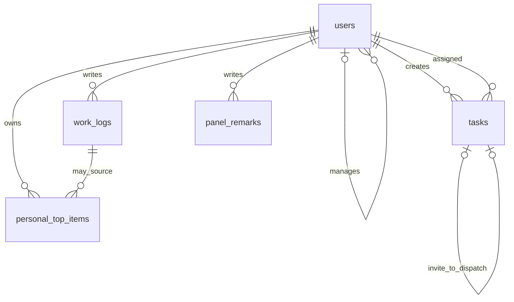

# ER 草案

对应产品文档 v0.5 §3.3 的六张表。

- `manager_id` 表示直属上级，不能形成环；降为员工前须先转移下属。
- `origin_invite_id` 将派发关联到原请示，保持唯一，避免重复转任务。
- 备注通过 `target_type + target_id` 指向公司事项或任务，仅作者可见。
- 公司派发直接读取任务表；个人十大事可关联本人的日志，刷新不覆盖整理后的内容。
