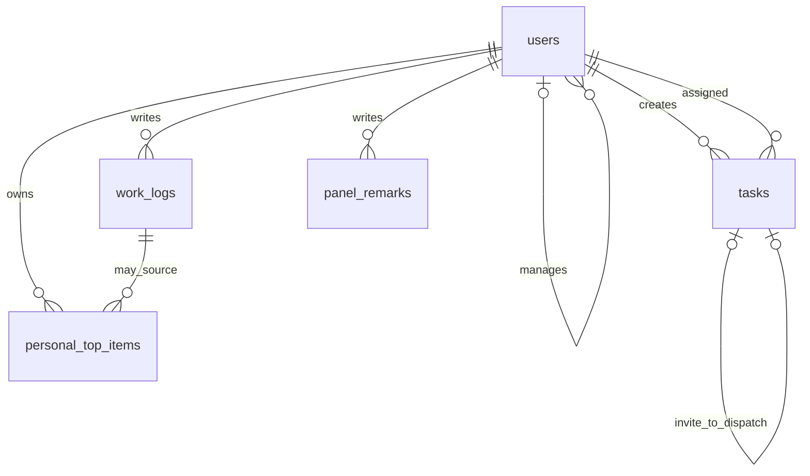

# ER 草案

与产品需求 v0.4 §3.3 的六张表一致，2026-09-19 需求分析待评审草案。`related_user_ids` 沿用任务表文本存储，实际约束须在实现前复核。

`users.manager_id` 表示可为空的直属上级；禁止自指、组织循环及将员工设为上级。仍有下属的上级降为 STAFF 前须先转移下属。角色与组织树共同决定可读范围，不能仅凭 LEADER 角色读取全公司数据。

`tasks.origin_invite_id` 是可空且唯一的自引用，限定为正式派发指向原邀约。一条邀约最多转为一条派发，接受邀约与创建派发必须是同一事务。邀约状态与派发状态分别取值，见产品文档 §3.3。

`panel_remarks` 通过 `target_type + target_id` 逻辑引用 company_items 或 tasks，二者择一，不是同时存在两条普通外键。服务端校验对象存在及当前用户有权读取，备注正文仅作者可见。删除公司事项时处理对应备注。

公司派发板块由 tasks 聚合，不在 company_items 重复保存派发。个人十大事可以引用本人的来源日志，保存后的内容和排序不被面板刷新覆盖。草稿与已提交日志都允许作者编辑，只有已提交日志对授权管理者可见。
