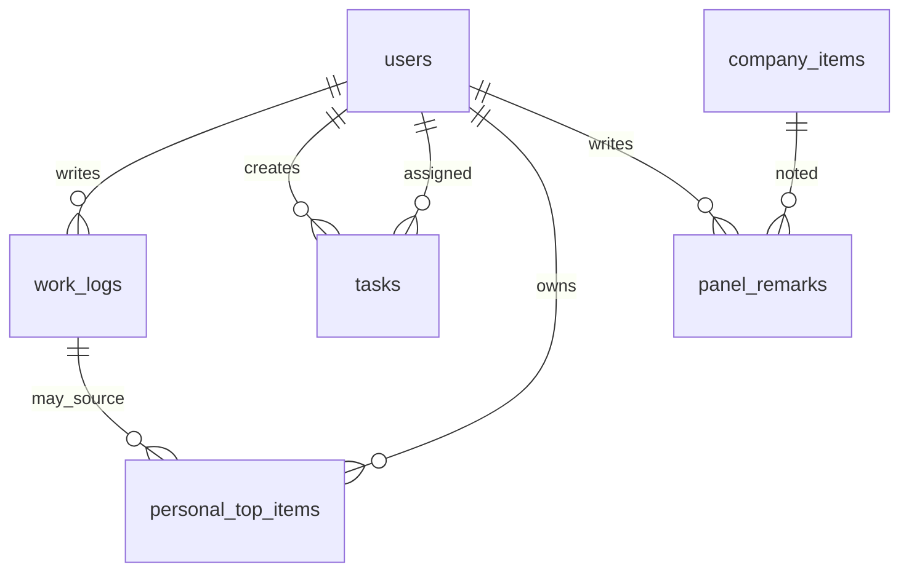

# ER 草案

和产品文档 §3.3 的六张表一致。`related_user_ids` 先放在任务表里，不另建关联表。

```mermaid
erDiagram
  users ||--o{ work_logs : writes
  users ||--o{ tasks : creates
  users ||--o{ tasks : assigned
  users ||--o{ personal_top_items : owns
  users ||--o{ panel_remarks : writes
  work_logs ||--o{ personal_top_items : may_source
  company_items ||--o{ panel_remarks : noted
```
